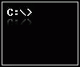

# Simple Shell



This project is a basic UNIX command line interpreter developed in C.

## Description

The shell supports various functionalities and evolves in versions as listed below:

- **0.1:** Initial version with basic functionality:
    - Display a prompt and await user input for commands.
    - Simple single-word commands without advanced features like pipes, redirections, or arguments.
    - Error handling for command not found.
    - Handles "end of file" condition (Ctrl+D).

- **0.1+** to **0.5+:** Adds functionality incrementally:
    - Handling command lines with arguments.
    - Implementing PATH handling and not calling fork if the command doesn't exist.
    - Adding built-ins like `exit`, `env`, and handling arguments for `exit`.

- **0.6+:** Introduces `setenv` and `unsetenv` built-ins:
    - `setenv VARIABLE VALUE` to initialize or modify an environment variable.
    - `unsetenv VARIABLE` to remove an environment variable.

- **0.7+:** Implements `cd` built-in:
    - Changes the current directory and updates the `PWD` environment variable.
    - Handles `cd -` and updates `PWD` accordingly.

- **0.8+:** Enhancements in command handling:
    - Commands separator `;`.
    - Shell logical operators `&&` and `||`.
    - Introduction of `alias` built-in for creating and printing aliases.

- **0.9+:** Variable handling and improvements:
    - Variables replacement, handling `$?` and `$$`.
    - Handles comments using `#`.

- **1.0:** Final version with file input functionality:
    - The shell can take a file as a command line argument.
    - Executes commands from the file (one per line) without a prompt or reading from stdin.

## Usage

To compile the shell:
```bash
gcc -Wall -Werror -Wextra -pedantic *.c -o simple_shell
```
To run the shell:
```bash
./simple_shell
```

For running commands from a file:
```bash
./simple_shell [filename]
```

## License

This project is licensed under the [MIT License](LICENSE).
